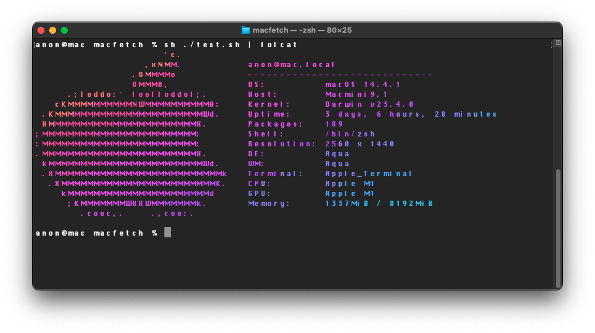

# MacFetch, the dedicated macOS neofetch clone!

User submitted message: "Wow, this is super cool!" - You, probably



## Requirements:

- [Swift 5.0](https://swift.org/download/)

## Installation:

### Build it and add it to your $PATH 

```bash
swiftc macfetch.swift -o macfetch
sudo mv macfetch /usr/local/bin
```
## Usage:
You can now run it with

```bash
macfetch
```

## Supporters:
[](https://github.com/neetware/macfetch/stargazers)
[](https://github.com/neetware/macfetch/network/members)
